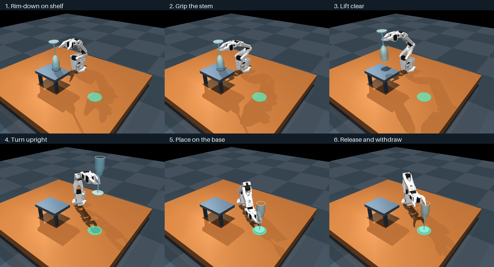

# ACT demo
A demonstration of using ACT (action-chunking with transformers) on an S0-100 arm to lift a champagne flute off a table, flipping it, and setting it on the floor.
## Previews
Task preview:

Demo:
<video src="./assets/expert_preview.mp4" controls width="100%">
</video>

## Overview
Pick paths/hyperparameters at `configs/act_flute.json`

| File | Description |
| --- | --- |
| `expert.py` | Baseline approach, grasp, lift, flip, place, release waypoints |
| `fast_dataset.py` | Cache future action targets without decoding future images |
| `periodic_training.py` | Connect LeRobot checkpoint saves to simulator evaluations |
| `evaluation.py` | ACT observation processing, action execution, metrics and video |
| `corrections.py` | Optional corrective expert and collection near the grasp region |

Adopted conventions:


https://github.com/user-attachments/assets/2237c4b9-b6f6-4760-9da2-c2fceb16afbb


- State/action order: Rotation, Pitch, Elbow, Wrist_Pitch, Wrist_Roll, Jaw.
- Actions are absolute joint position targets in radians at 50 Hz.
- `observation[t]` is captured before `action[t]` is applied.
- ACT receives overview RGB, wrist RGB, and six robot joint positions.
- Simulator object pose is recorded for inspection and scoring; it is not a policy input.
- ACT predicts 100 actions, executes 16, then predicts again.
- Training samples the fixed demonstration dataset. Evaluation results do not update weights.

## Installation

Install [uv](https://docs.astral.sh/uv/) first. From this directory:

```bash
./scripts/setup.sh
./scripts/scene.sh
./scripts/generate.sh --episodes 20
./scripts/convert.sh
./scripts/train_macos.sh
```

The macOS training script selects MPS, eight data workers, and Accelerate BF16.
For CPU or CUDA, use `./scripts/train.sh --device cpu` or `--device cuda`.
The JSON recipe keeps batch 64, AdamW LR 2e-5 for all parameter groups, seven
decoder layers, 200,000 updates, no LR schedule, no EMA, and no augmentation.
Checkpoints and ten-seed evaluations run every 2,000 updates, with one example
video per checkpoint.

Evaluate a saved policy and record a video:

```bash
./scripts/evaluate.sh outputs/act_flute/checkpoints/last/pretrained_model --output outputs/manual_eval --device mps --video --video-episodes 1
```

Replay an expert demonstration in the interactive viewer:

```bash
./scripts/replay.sh data/expert_v1/episode_000000.hdf5 --viewer
```
